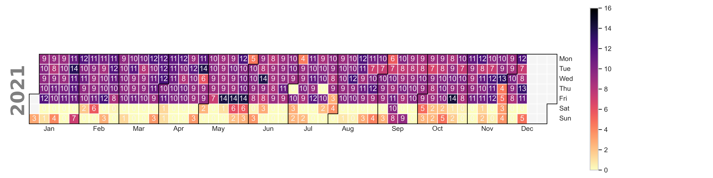

# TakeMeOut

Use your geolocation data from Google Checkout to track your habits.

# Dependencies

You need to have the following installed:

- `iso8601`
- `matplotlib`
- `pandas`
- `seaborn`
- `calplot`

# How To Use

1. Download google location data from [here](https://takeout.google.com/settings/takeout?pli=1).
2. Set the config.py directory to the path of your unzipped download.
3. Pick the location you want to analyze
4. Run main.py
5. Explore your outputs